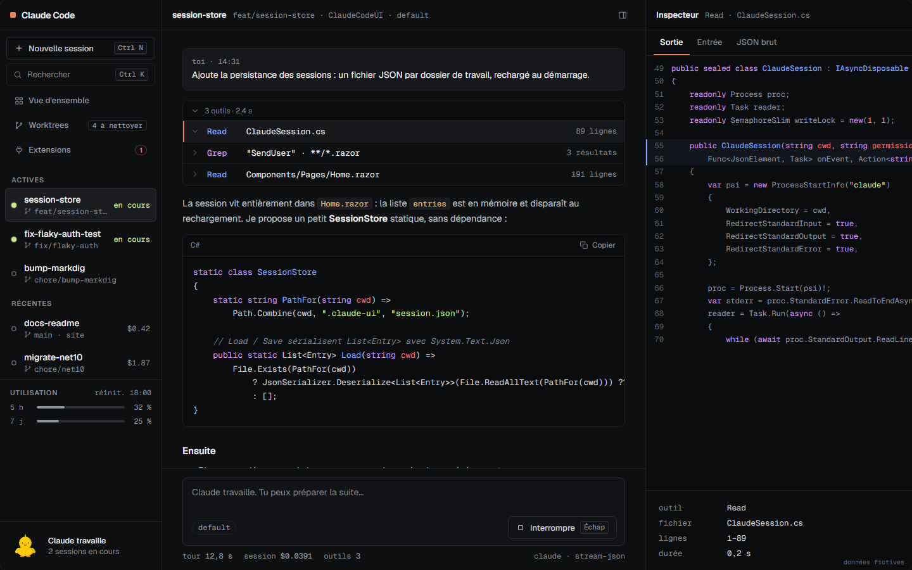

[English](README.md) · **Français**

# Claude Code UI

Une console de bureau pour [Claude Code](https://docs.claude.com/en/docs/claude-code/overview). L'application pilote le vrai CLI `claude` (protocole stream-json, les mêmes options que le SDK et l'extension VS Code) et affiche les sessions de façon plus lisible qu'un terminal : texte en direct, journal des outils, permissions avec diff, plusieurs sessions en parallèle, worktrees git. Interface disponible en français et en anglais, thèmes sombres uniquement.



## Installation

Télécharge l'installeur de ton système sur la page des [versions GitHub](https://github.com/Atypical-Consulting/ClaudeCodeUI/releases/latest). Aucun SDK .NET ni navigateur particulier n'est nécessaire : l'application embarque son serveur et utilise la vue web du système.

| Système | Fichier | Remarque |
|---|---|---|
| Windows 10/11 | `.msi` ou `-setup.exe` | Installeur non signé : SmartScreen affiche « Windows a protégé votre ordinateur ». Clique sur « Informations complémentaires » puis « Exécuter quand même ». WebView2 est déjà présent sur Windows 11. |
| macOS (Apple Silicon) | `.dmg` (`aarch64`) | Signée avec un Developer ID et notariée par Apple : elle s'ouvre normalement, sans manipulation. Les Mac Intel ne sont pas pris en charge (macOS 26 est leur dernière version). |
| Linux x64 | `.AppImage` ou `.deb` | Nécessite WebKitGTK 4.1 (`libwebkit2gtk-4.1-0` sur Debian/Ubuntu, déjà installé sur la plupart des bureaux). Pour l'AppImage : `chmod +x` puis lancer. |

**Vérifier le téléchargement.** Chaque version publie un fichier `SHA256SUMS` (`shasum -a 256 -c SHA256SUMS`) et des attestations de provenance GitHub : `gh attestation verify <fichier> -R Atypical-Consulting/ClaudeCodeUI`.

### Prérequis : Claude Code

Le CLI Claude Code doit être installé et connecté :

```sh
# macOS, Linux, WSL
curl -fsSL https://claude.ai/install.sh | bash
# Windows (PowerShell)
irm https://claude.ai/install.ps1 | iex
```

Lance ensuite `claude` une fois dans un terminal pour te connecter. Si `claude` n'est pas trouvé dans le PATH, l'application affiche un écran d'aide au lieu de l'écran de démarrage. Sur macOS, l'application lit le PATH de ton shell de connexion, donc une installation faite dans `~/.zshrc` est bien prise en compte.

## Fonctionnalités

- Nouvelle session : dossier, worktree isolé, mode de permission, premier message.
- Texte en direct, indicateur de réflexion, journal d'outils avec inspecteur (sortie, entrée, JSON).
- Demandes de permission avec diff : autoriser, refuser, ou autoriser pour toute la session.
- Vue d'ensemble de toutes les sessions et file des décisions en attente (Ctrl ⇧ A).
- Palette de commandes (Ctrl K), reprise des sessions récentes avec historique.
- Modèle, effort, sous-agents, contexte, serveurs MCP, skills et plugins.
- Quota 5 h / 7 jours, coût par tour.
- Worktrees : classement et nettoyage sûr.
- Cinq thèmes sombres et taille du code réglable.

## Développement

Prérequis : SDK .NET 10. Pour l'application de bureau : Rust (stable), Node 20+ et les [prérequis Tauri](https://v2.tauri.app/start/prerequisites/) de ton système.

```sh
dotnet run                     # serveur web seul : ouvrir l'URL http://localhost:5284/?token=… qu'il affiche
dotnet run -- --self-check     # vérifications intégrées, code de sortie non nul en cas d'échec
```

Application de bureau (dossier `desktop/`) :

```sh
cd desktop
npm install
npm run server                 # publie le serveur autonome pour ta machine dans src-tauri/server
npm run dev                    # lance la fenêtre Tauri (équivaut à cargo tauri dev)
npm run build                  # produit les installeurs dans src-tauri/target/release/bundle
```

La coque Tauri lance `ClaudeCodeUI --desktop-port 0 --parent-pid <pid>` (HTTP sur 127.0.0.1 uniquement, environnement Production, accès protégé par un jeton à usage local transmis sur la sortie standard), affiche un écran de chargement, puis ouvre l'interface. Le serveur s'arrête tout seul quand la fenêtre se ferme, et arrête avec lui les processus `claude`. Relance `npm run server` après chaque modification du code .NET.

## Publication

1. Les commits suivent les [Conventional Commits](https://www.conventionalcommits.org/fr/) (`feat:`, `fix:`, `docs:`, `ci:`, `chore:`).
2. À chaque push sur `main`, [release-please](https://github.com/googleapis/release-please) ouvre ou met à jour une PR de version : CHANGELOG, et version dans `ClaudeCodeUI.csproj`, `tauri.conf.json` et `Cargo.toml`.
3. Fusionner cette PR crée le tag et la version GitHub. Le workflow `release.yml` construit alors les installeurs Windows, macOS (Apple Silicon) et Linux, et les attache à la version.

## Licence

[MIT](LICENSE) © 2026 Atypical Consulting
