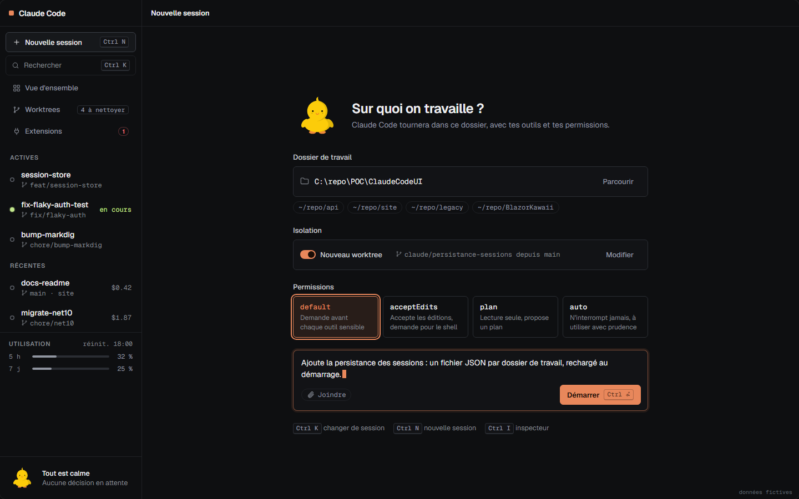
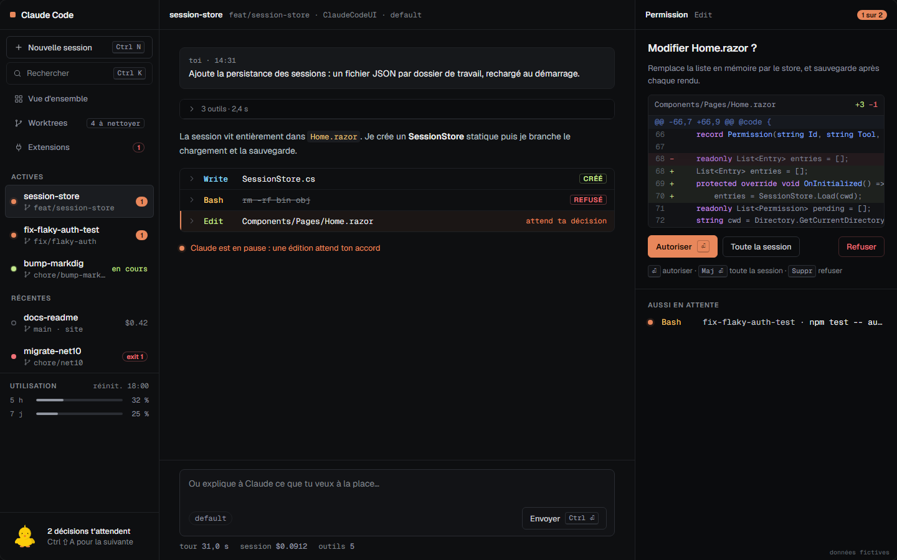
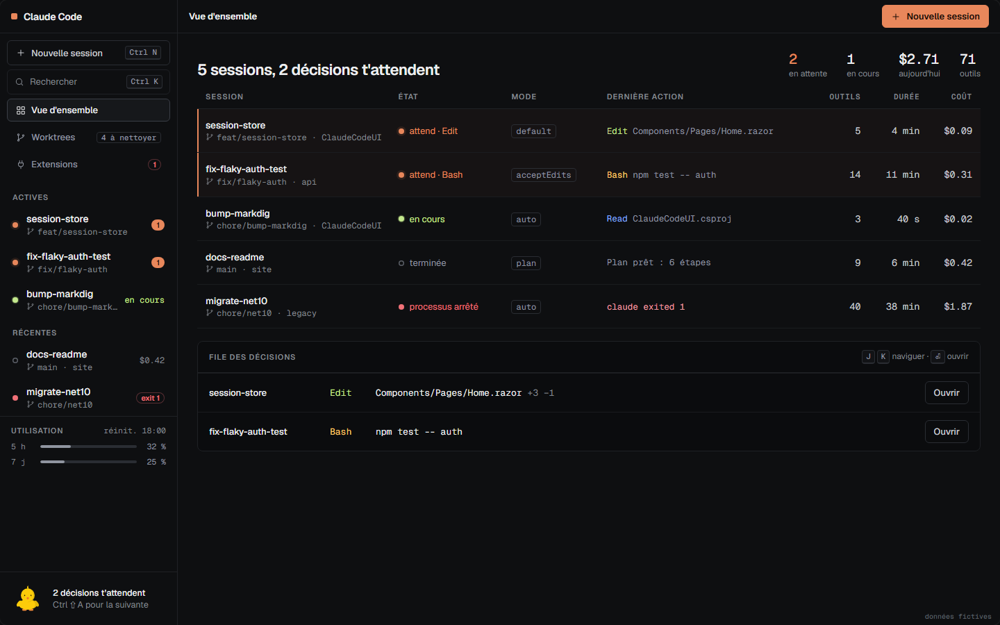
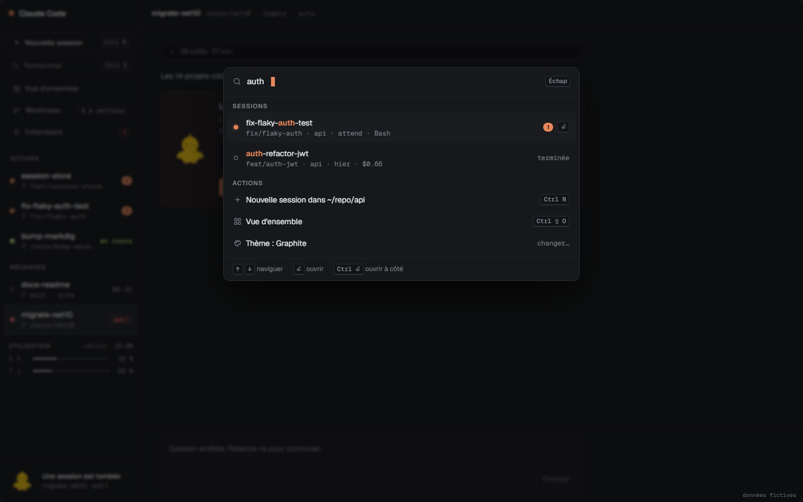
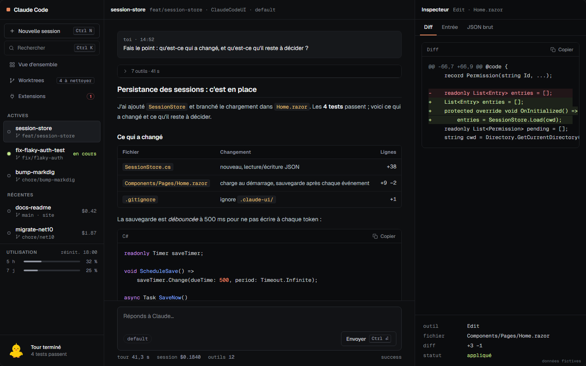
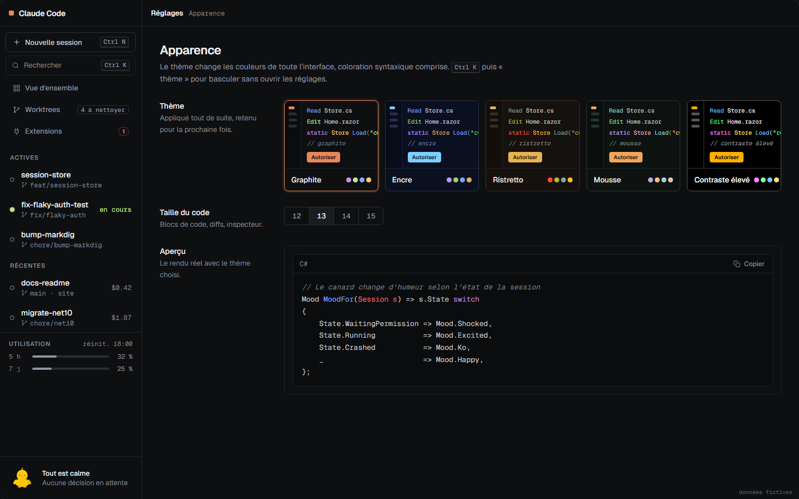
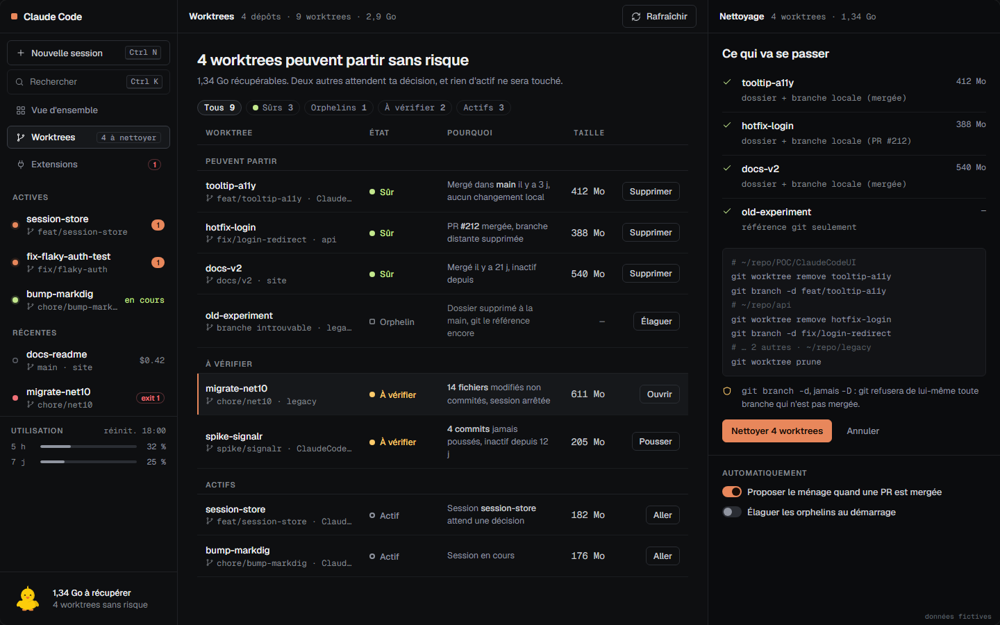
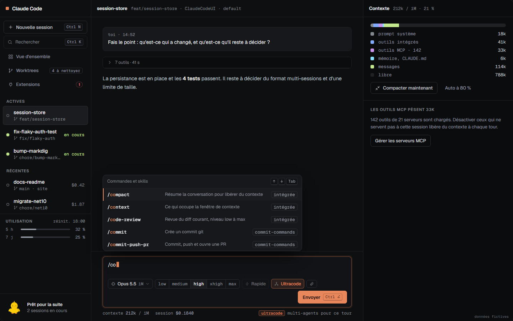
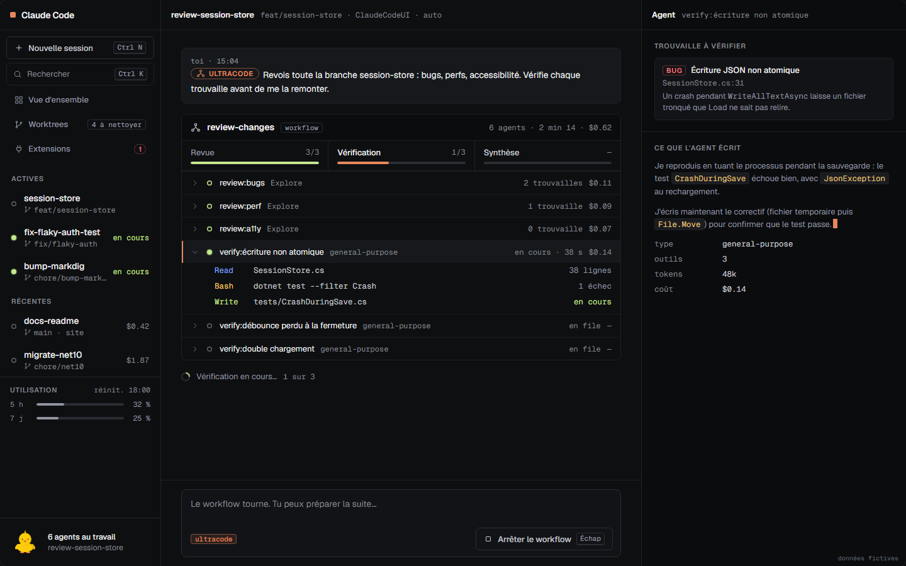
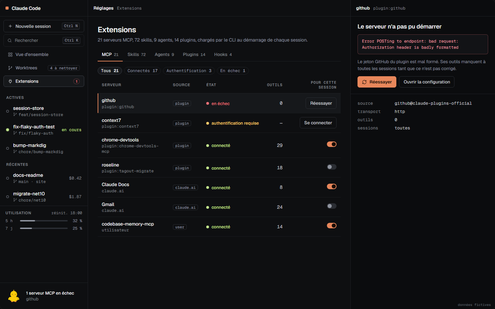

# Mockups · Console graphite

Maquettes de l'interface web de Claude Code UI. Ouvrir [`index.html`](index.html) dans un navigateur : 11 écrans, 5 thèmes sombres, sélecteur de thème en haut de page. Les noms, coûts et durées sont fictifs.

| # | Écran | |
|--:|---|---|
| 1 | Démarrage d'une session (dossier, worktree, mode de permission) |  |
| 2 | Session en cours (streaming, journal d'outils, inspecteur) |  |
| 3 | Demande de permission (diff complet) |  |
| 4 | Vue d'ensemble multi-sessions et file des décisions |  |
| 5 | Sélecteur `Ctrl K` et processus arrêté |  |
| 6 | Rendu markdown (sortie Markdig + highlight.js) |  |
| 7 | Apparence et thèmes |  |
| 8 | Worktrees : ménage sans risque |  |
| 9 | Composer : modèle, effort, ultracode, commandes `/` |  |
| 10 | Ultracode et sous-agents |  |
| 11 | Extensions : MCP, skills, agents, plugins, hooks |  |

## Régénérer

Les sources sont dans `.impeccable/mockups/` (`graphite.src.html` + `build.js`). Les SVG du canard (BlazorKawaii 2.2.0) et le HTML Markdig sont pré-rendus dans `inputs/`.

```bash
bash .impeccable/mockups/shoot.sh   # reconstruit index.html et capture les écrans dans .impeccable/review/
```

Direction et contrat de design : [`PRODUCT.md`](../../PRODUCT.md), [`.impeccable/surfaces/`](../../.impeccable/surfaces/).
